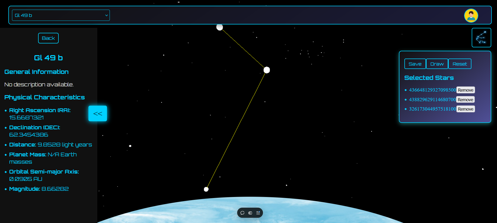

# Exosky - Night Sky Exploration Website


[Instruction for Exploration](./Demo/EXOSKY_DEMO.pdf)
|| [Project Details](./Demo/ExoskyDetails.pdf)

## Overview

**Exosky** is a React-based website designed to explore the night sky from different viewpoints, including Earth and exoplanets. Users can visualize stars, exoplanets, and constellations using interactive 3D models. This project is developed in collaboration with team Yara as part of NASA Space Apps Challenge 2024.

## Features

- **Night Sky Visualization**: Explore the night sky with real-time 3D renderings of stars and exoplanets.
- **Constellation Builder**: Connect stars interactively to form constellations.
- **Multiple Viewpoints**: View the sky from Earth or distant exoplanets.
- **Dynamic Interactions**: Users can select stars, apply properties, and save constellation drawings.

## Project Details

This project was created by Team YARA for the NASA Space Apps Challenge 2024 and Presented/Developed During Local Event of Hackathon at Nashik.

You can find more details about the challenge and our submission here:
[Exosky - NASA Space Apps 2024](https://www.spaceappschallenge.org/nasa-space-apps-2024/find-a-team/yara/?tab=project)

## Technologies Used

- **Frontend**: React, Three.js
- **Backend**: Flask API
- **Database**: MongoDB
- **Deployment**: [Vercel: Nakshtra-Exosky](https://nakshtra-exosky.vercel.app)

## Installation

To run the project locally:

1. Clone the repository:
   ```bash
   git clone https://github.com/rajnandale/Nakshtra-Exosky.git
   cd Nakshtra-Exosky
   npm i
   npm run dev
  Note : It requires environment variable for backend_url thus use https://exoskyapi.vercel.app
